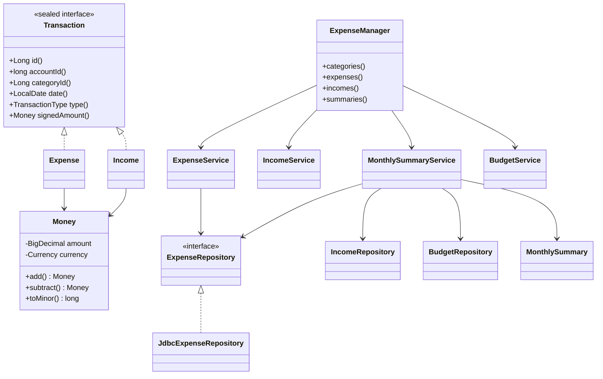

# Architecture

## Layering (Clean Architecture)

```
        ┌───────────────────────────────────────────────┐
        │  UI  (expense-desktop / expense-android)       │
        │  Views  ──bind──►  ViewModels   (MVVM)         │
        └───────────────┬───────────────────────────────┘
                        │ depends on
        ┌───────────────▼───────────────────────────────┐
        │  Application services (expense-core.service)   │
        │  ExpenseService, IncomeService, Category...,   │
        │  BudgetService, MonthlySummaryService          │
        └───────────────┬───────────────────────────────┘
             uses ports │            ▲ operates on
        ┌───────────────▼──────────┐ │ ┌───────────────────────────┐
        │ Repository PORTS (iface) │ │ │ Domain (immutable records)│
        │ *Repository              │ │ │ Money, Expense, Income,   │
        └───────────────┬──────────┘ │ │ Category, Budget, ...     │
             implemented│            │ └───────────────────────────┘
        ┌───────────────▼──────────┐ │
        │ JDBC/SQLite ADAPTERS     │─┘
        │ Jdbc*Repository          │
        └──────────────────────────┘
```

Dependencies point **inward**: services depend on repository *interfaces*, never
on JDBC. This is what lets Android supply its own SQLite-backed adapters while
reusing every service and rule.

## Key design decisions

- **SOLID / DIP.** Services receive repositories via constructor injection
  (`ExpenseManager` is the composition root). Each service is unit-testable in
  isolation with fakes.
- **Immutability.** Entities are Java `record`s; "mutation" returns copies
  (`withId`, `withArchived`). The `Money` value type is immutable and currency-safe.
- **Sealed `Transaction`.** `Expense` and `Income` implement a sealed interface so
  analytics treat both uniformly (`signedAmount()`) without duplicated logic.
- **Sign convention enforced twice.** Domain constructors normalise sign; DB
  `CHECK (amount_minor <= 0 / >= 0)` is the last line of defence.
- **Extension seams (open/closed).** `network.SyncClient` (cloud sync),
  `network.ReceiptScanner` (OCR), `network.ExpenseCategorizer` (AI categorisation,
  with a working offline `HeuristicExpenseCategorizer` default), and
  `report.WorkbookImporter/WorkbookExporter` (Excel) are all interfaces. Future
  features drop in without touching business logic — enabling cloud sync, OCR,
  AI categorisation and multi-user support with no architectural change.

## Class diagram (core)


