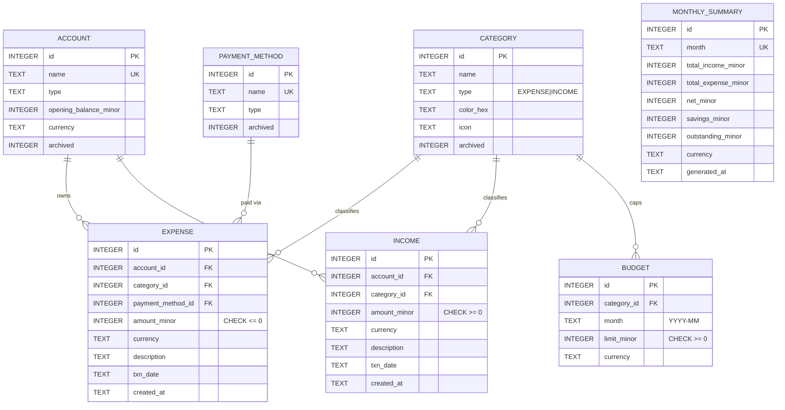

# Database

SQLite, normalised, foreign keys enforced (`PRAGMA foreign_keys = ON`).
Monetary values are stored as **INTEGER minor units** (e.g. cents); dates as
ISO-8601 TEXT. The full DDL lives in
`expense-core/src/main/resources/db/schema.sql` and is applied idempotently on
startup by `SchemaInitializer`.

## Entity–relationship diagram

## Referential-integrity rules

- `expense.account_id`, `income.account_id` → `account` **ON DELETE RESTRICT**
  (cannot delete an account that still owns transactions).
- `expense.category_id`, `income.category_id` → `category` **ON DELETE SET NULL**
  (deleting a category preserves transaction history as "Uncategorised").
- `budget.category_id` → `category` **ON DELETE CASCADE**.
- `monthly_summary` is a recomputable cache keyed uniquely by `month`.
